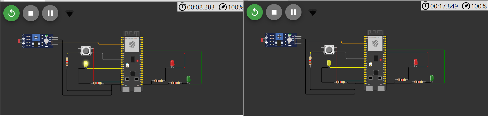
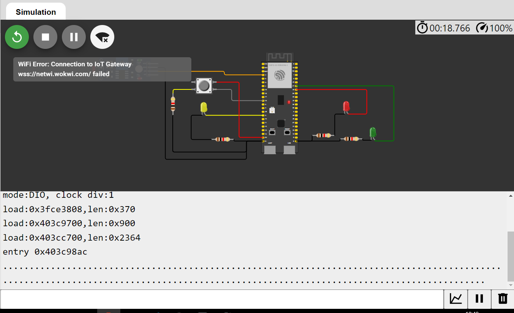
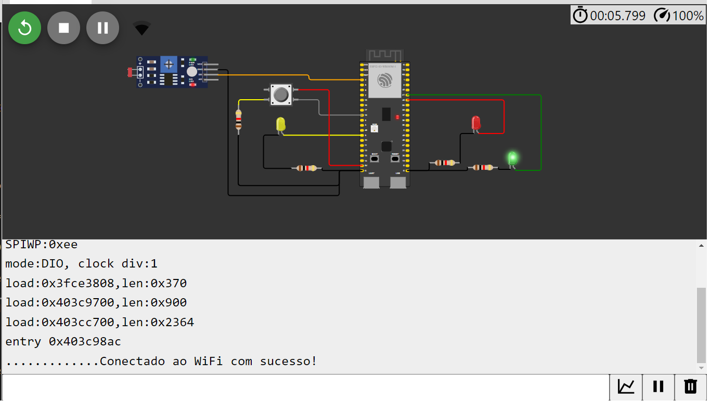
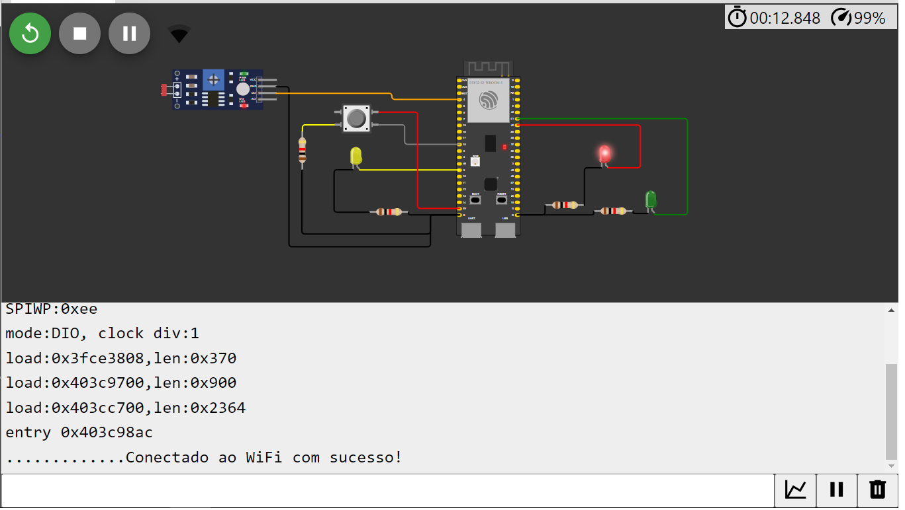
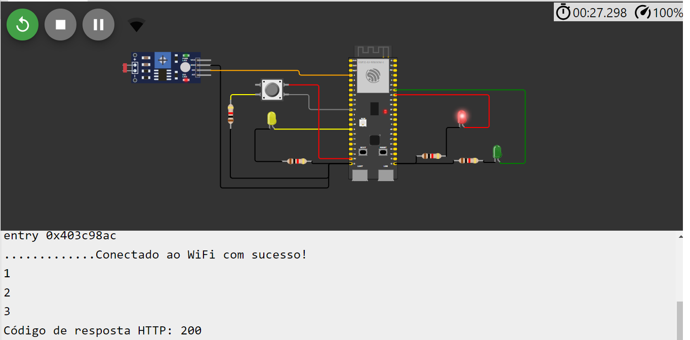

# Prova módulo 4
## Aluno: Caio de Alcantara Santos, Turma 11

### Estados do sistema:

&emsp;O sistema construído possui 2 estados distintos:
* Modo noturno, onde, caso o LDR aponte baixa luminosidade (indicando, por exemplo, que está de noite), apenas a luz amarela fica acesa e piscando intermitentemente. 
* Modo diurno, onde ocorre a ciclagem convencional entre as luzes verde, amarela e vermelha. Neste modo, há ainda a possibilidade de interagir com um botão, porém apenas caso a luz que esteja acesa seja a vermelha, ou seja, com o farol fechado. 
* Interação com o botão: Caso o botão seja apertado uma vez enquanto a luz vermelha está acesa, é esperado 1 segundo e então é feita a troca para a luz verde. Caso seja apertado 3 vezes seguidas, uma requisição HTTP é feita (para exemplo, foi feita para o site padrão do Google) a fim de simular um alerta sendo enviado.

**Observações:**

* Por conta de instabilidades no Wokwi, como demora excessiva para compilar o código e instabilidade na rede WiFi aberta (sim, eu corrigi a "pegadinha" que estava no código. O problema com WiFi era do Wokwi mesmo e percebi isso uma vez que, às vezes, ele decidia que queria conectar com sucesso no WiFi), não foi possível realizar tantos testes no código como eu gostaria. Dessa forma, o código que é enviado neste repositório:

**Implementa corretamente**: 
- Todo o código deve estar padronizado para inglês ou português, incluindo comentários (1,0 ponto);
- Todas as entradas e saídas devem estar declaradas corretamente na inicialização (1,0 ponto);
- Todos os leds devem estar apagados na inicialização (até 1,0 ponto);
- Quando estiver escuro (segundo a leitura analógica do sensor LDR), o protótipo deve ativar o modo noturno e piscar o led amarelo a cada segundo (até 1,0 ponto);
- O protótipo deve suportar debounce na leitura do botão (até 1,0 ponto);
-  Quando estiver claro (segundo a leitura analógica do sensor LDR) e o semáforo estiver no estado fechado (somente led vermelho aceso) e o botão for pressionado 3 vezes, você deve enviar uma requisição HTTP para implementar um alerta (realize uma requisição para o http://www.google.com.br/ para fins de teste) (até 1,0 ponto).

**Não implementa, ou implementa parcialmente**:
- Quando estiver claro (segundo a leitura analógica do sensor LDR) e o semáforo estiver no estado fechado (somente led vermelho aceso) e o botão for pressionado, o semáforo deve abrir 1 segundo após o pressionamento do botão (até 2,0 pontos);
- Quando estiver claro (segundo a leitura analógica do sensor LDR), o protótipo deve ativar o modo convencional e fazer a temporização alternando entre verde (3 segundos), amarelo (2 segundos) e vermelho (5 segundos) (até 2,0 pontos);

### Imagens de demonstração:

**Demonstração de funcionamento do modo noturno**

**Demonstração de erro WiFi Wokwi**

**Demonstração de led verde ativo no modo diurno**

**Demonstração de led vermelho ativo no modo diurno**

**Demonstração de requisição HTTP ao apertar botão 3x**

